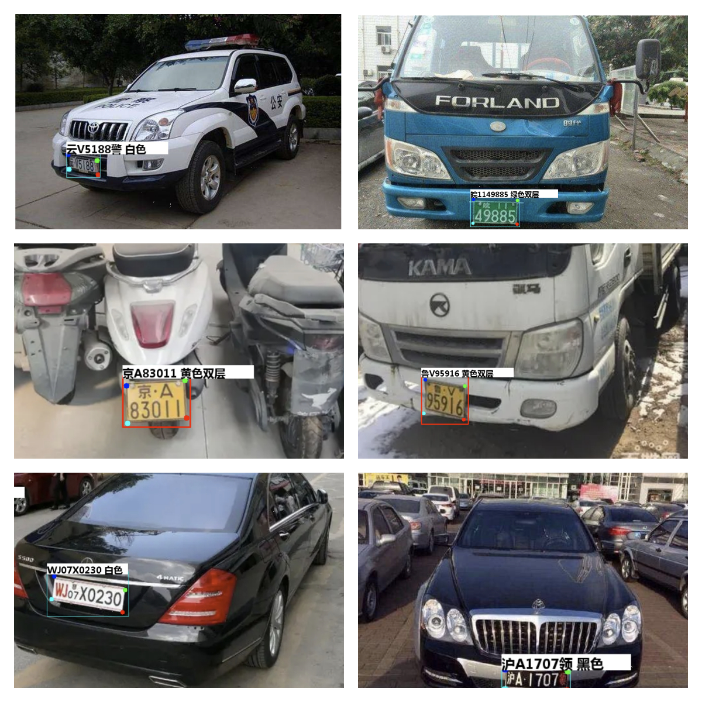

## **最全车牌识别算法，支持12种中文车牌类型**

**环境要求: python >=3.6  pytorch >=1.7**

#### **图片测试demo:**

直接运行detect_plate.py 或者运行如下命令行：

```
python detect_plate.py --detect_model weights/plate_detect.pt  --rec_model weights/plate_rec_color.pth --image_path imgs --output result
```

测试文件夹imgs，结果保存再 result 文件夹中

#### **支持如下：**

- [X] 1.单行蓝牌
- [X] 2.单行黄牌
- [X] 3.新能源车牌
- [X] 4.白色警用车牌
- [X] 5.教练车牌
- [X] 6.武警车牌
- [X] 7.双层黄牌
- [X] 8.双层白牌
- [X] 9.使馆车牌
- [X] 10.港澳粤Z牌
- [X] 11.双层绿牌
- [X] 12.民航车牌


